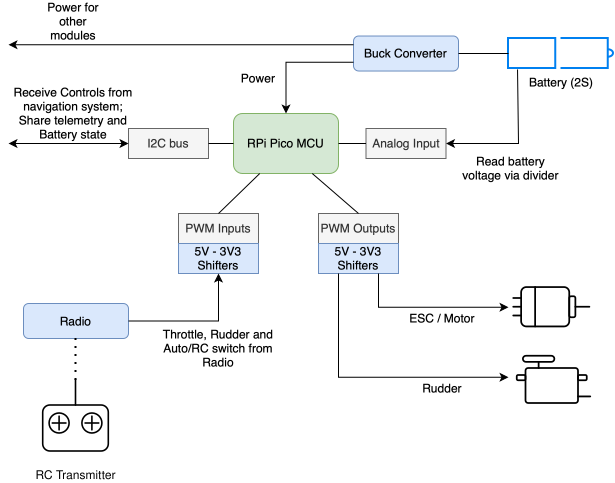

## Body Control Unit

The body control unit sits between the radio, the autopilot (main controller) and the boat's
actuators. It solves four problems:

- **Relaying between RC and autopilot:** a switch on the transmitter allows to alternate between RC and autopilot inputs.
- **Failsafe:** a lost or stale signal from either side sets that output to neutral, whatever
  happens upstream.
- **Battery monitoring:** measures the pack voltage and reports it, with a low-battery flag.
- **Power:** a buck converter on the board supplies the rest of the electronics from the
  battery.

- Board: Raspberry Pi Pico (RP2040), MicroPython
- Sources: [`electronics/body_control_unit_rpipico_mp/src/`](src/)

## Connections

| GPIO | Role |
|---|---|
| 2 | Throttle output to the ESC (hardware PWM, 50 Hz) |
| 4 | Rudder servo output (hardware PWM, 50 Hz) |
| 3 | RC throttle input (pulse width measured with PIO) |
| 5 | RC rudder input |
| 7 | RC mode switch: below 1400 us = RC control, above 1600 us = main controller |
| 14 / 15 | I2C SDA / SCL to the main controller (target, address `0x31`) |
| 28 | Battery voltage, 2S pack through a 10k/5k divider (Vbat = Vadc x 3) |
| 0 / 1 | UART console (TX / RX, 115200): REPL, logs and uploads |

Details per pin: [pins_map.txt](src/pins_map.txt)

## How it works

A 50 Hz loop reads the inputs, picks the outputs and publishes a status block:

- **Control mode** comes from an RC channel, so the transmitter can always take over. Between
  the two thresholds the current mode is kept, so a noisy switch doesn't flicker.
- **RC control:** the receiver's throttle and rudder pulses are passed through, clamped to
  1000-2000 us.
- **Main controller control:** throttle and rudder arrive as -100..100 % over I2C and are
  mapped to 1000-2000 us.
- **Failsafe:** an RC pulse older than 200 ms, or a main controller command older than 750 ms,
  counts as lost, and that output goes to neutral (1500 us). Command frames that fail their
  checksum are ignored, so they don't count as fresh. The failsafe flag in the status block
  says so. If the mode channel itself is lost, control goes back to RC.
- **Battery:** sampled and lightly filtered every pass. Below 6.4 V (3.2 V per cell) the
  low-battery flag is set; nothing else is done about it yet.
- **Watchdog:** in production mode (a `production` file on the board) a 2 s hardware watchdog
  resets the board if the loop stops. See [NOTES.md](src/NOTES.md) for how to still get in to
  upload.

## I2C interface

The main controller is the I2C controller; the Pico is a target at `0x31`, with a register
map (the full byte layout is at the top of [`src/main.py`](src/main.py)):

- **Command frame** at `0x00`, written by the main controller: throttle, rudder, flags, a
  sequence number that has to change with every frame, and a checksum. A frame with the same
  sequence number as the previous one is not new, so a stuck controller can't keep the boat
  going.
- **Status block** at `0x10`, read by the main controller: heartbeat, status flags (control
  mode, command / RC freshness, low battery, failsafe, watchdog reset), battery voltage in mV,
  the measured RC pulses, the pulses being output, loop overruns and command errors, plus a
  checksum.

The main controller's side is `bcu.py` in
[`electronics/main_controller_esp32_mp`](../main_controller_esp32_mp).
