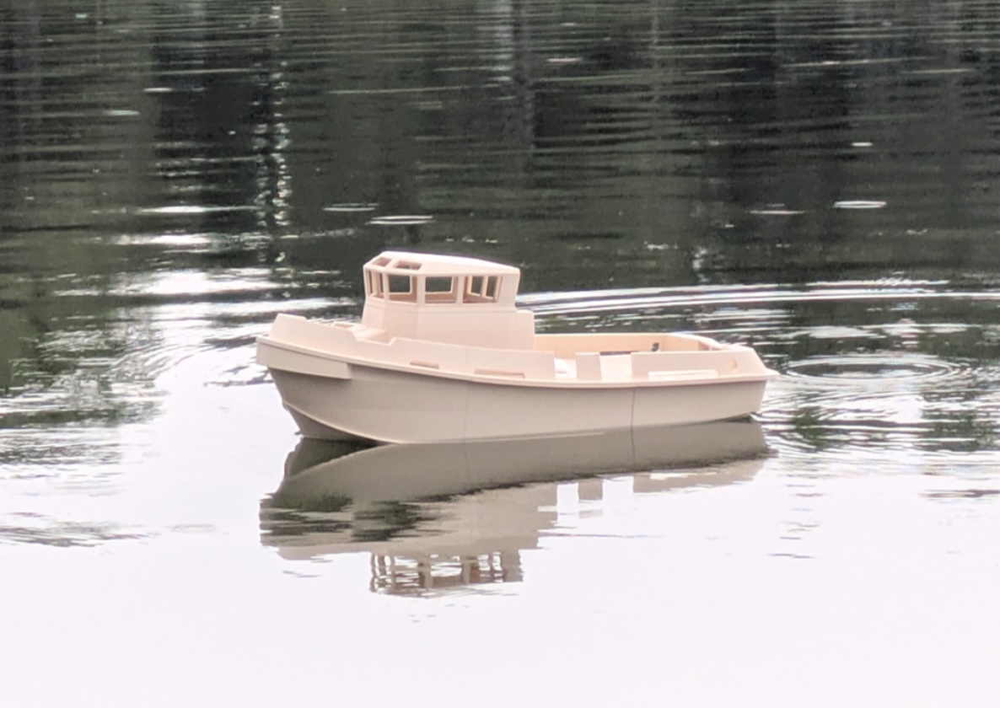

# Mission 1 — Chassis testing

First on-water run of the chassis — a 15 minute cruise at part throttle
in calm water, to check for water ingress and to get a first real-world
figure for power draw.

## Conditions

| | |
|---|---|
| Weather / water | Calm |
| Chassis weight | 1250 g |

## Run parameters

| | |
|---|---|
| Throttle position | 40% |
| Average speed | 0.6 m/s |
| Run time | 15 min |

## Battery

| | |
|---|---|
| Type | 2S, 800 mAh |
| Voltage — initial | 8.5 V |
| Voltage — final | 7.7 V |

## Observations

- **Ingress of water**: below registering threshold.

## Power consumption

*Calculated power consumption: TBD.*
