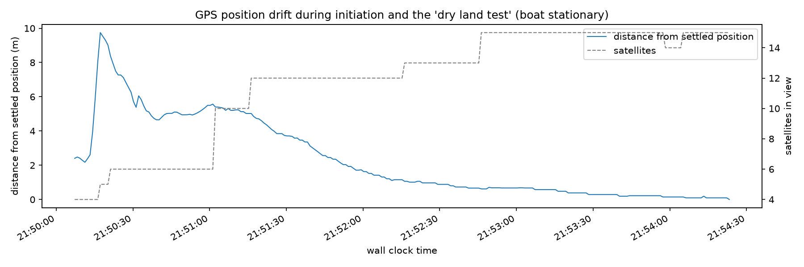

# Mission 2 — GPS precision testing

Details, plots and code: [data_analytics/analytics.ipynb](data_analytics/analytics.ipynb).

## Objectives

1. **GNSS precision** — how much the position scatters and drifts, on dry land
   and floating on water.
2. **Boat speed** — verify the speed at 40-50% throttle that power
   consumption figure relies on (Mission #1).
3. **Time to a usable fix** — how long after power-on the position can be trusted.
4. **GNSS lag** — check the suspected delay between real motion and reported motion.

## Setup

| | |
|---|---|
| Board | Heltec WiFi LoRa 32 V4 (ESP32-S3) |
| GNSS module | Quectel L76K (Airoha AT6558R), onboard antenna |
| Fix rate | 1 Hz, logged over USB serial |
| Firmware | [esp32_firmware](esp32_firmware/) |
| Weather / sky view | Partly cloudy |

## Exercises

| Exercise | Duration | Purpose |
|---|---|---|
| dry land test | 2 min 35 s | Stationary on land — baseline precision |
| water float test 1 | 45 s | Floating, no power — precision on water |
| water float test 2 | 2 min | Same, longer |
| run test 1 | 17 s | Straight run at ~50% throttle — speed |
| run test 2 | 19 s | Same, second pass |

## Results

### Getting a fix

| Milestone | Time after power-on |
|---|---|
| First fix (4 sats, HDOP 25.5) | ~42 s |
| 10+ satellites | ~1 min 37 s |
| HDOP below 1 | ~1 min 52 s |
| 15 satellites (max seen) | ~3 min 21 s |

Early fixes are unreliable: during the first minutes the position was up to
**9.75 m** away from where it finally settled.

### Precision

Stationary scatter per exercise (distance from the window's median position):

| Exercise | Sats / HDOP | 50% within | 95% within |
|---|---|---|---|
| dry land test | 14 / 0.76 | 0.38 m | 1.70 m |
| water float test 1 | 15 / 0.70 | 0.29 m | 0.53 m |
| water float test 2 | 15 / 0.70 | 0.22 m | 0.37 m |

- **Jitter** is small — around 0.3 m reading to reading once settled.
- **Drift** is the bigger issue — the settled position wandered ~2–3 m over
  a ~4 minute stationary window.

### Speed

At ~50% throttle, measured as straight-line distance over time (first 10 s of
each run trimmed for possible GNSS lag):

| Run | Speed | Distance |
|---|---|---|
| run test 1 | 0.96 m/s | 5.8 m |
| run test 2 | 1.07 m/s | 8.6 m |

**~1 m/s confirmed** — Mission 1's 3.75 Wh/km estimate holds.

Open question: the module's own speed-over-ground reads only ~1.5 kn
(~0.77 m/s) during the runs — ~25% lower than the position-based figure. Not
explained yet.

### Lag

Visible in the data — reported motion starts noticeably after the throttle
marker, hence the 10 s trim above. **Not quantified yet.**

## Observations

- **The module "freezes" when it registers it's standing still.** When it reports
  zero speed, 62% of consecutive fixes are *exactly* identical. This looks like static hold — the chip pins the position instead of
  letting it jitter. Nice for a stable readout, but it makes the float tests
  look more precise than the raw signal really is.
- **Back where we started.** The boat finished the session at the spot of the
  dry land test, and the GPS agreed to within a few tens of centimeters.

## Terminology

- **Precision** — how much the reported position scatters around its own
  average, regardless of where that average is. Can be measured from the GNSS
  log alone (e.g. a stationary test), but can't reveal a constant offset.
  - **Jitter** — fast, reading-to-reading scatter (seconds).
  - **Drift** — slow wander of the position (minutes). Formally still
    precision, but over a short mission it behaves like an offset, so always
    state the time window.

## Takeaways for the project

| | |
|---|---|
| Before navigating | Wait for 10+ satellites and HDOP < 1 (~2 min from power-on) |
| Waypoint radius | ≥ 5 m |
| Filtering | Smooths jitter, won't fix drift |
| Heading at ~1 m/s | GPS course over ground probably unreliable — consider a compass |

## Next steps

- Quantify the GNSS lag (align throttle markers with the first reported motion).
- Explain the speed-over-ground vs position-based speed gap.
- Long static test (30–60 min) to see the full drift envelope.
- Ground-truth test if for real accuracy test.
